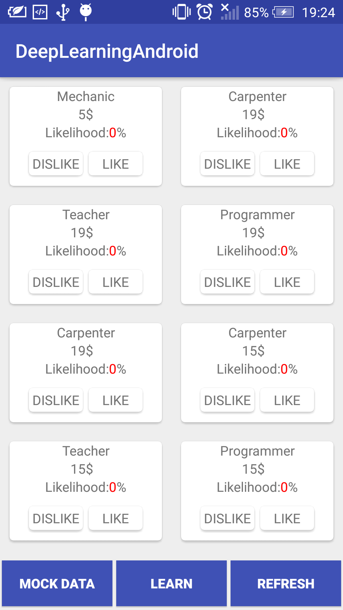
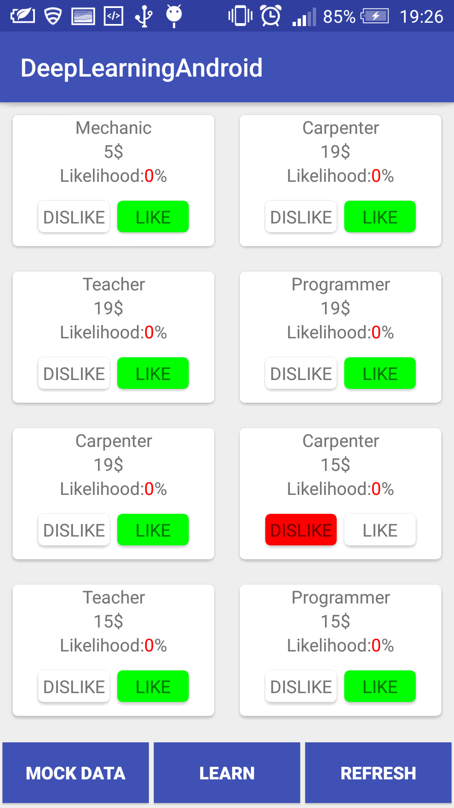
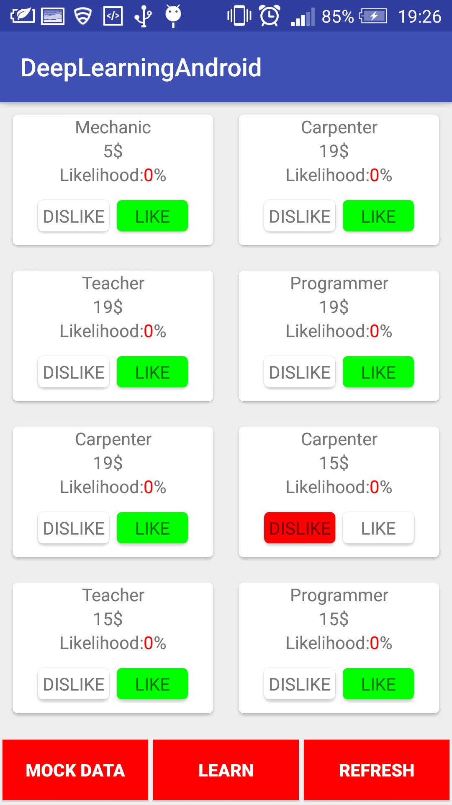
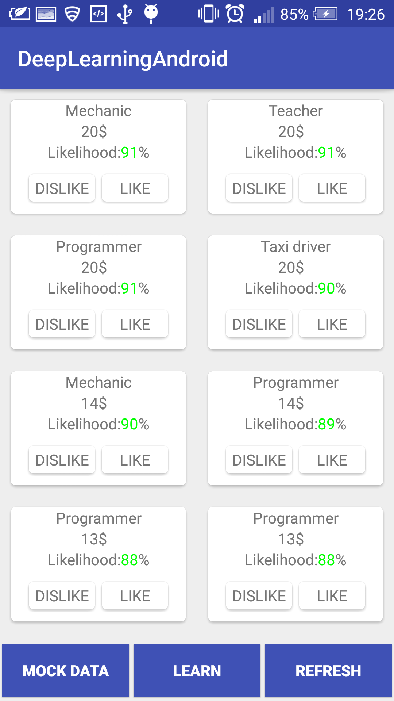
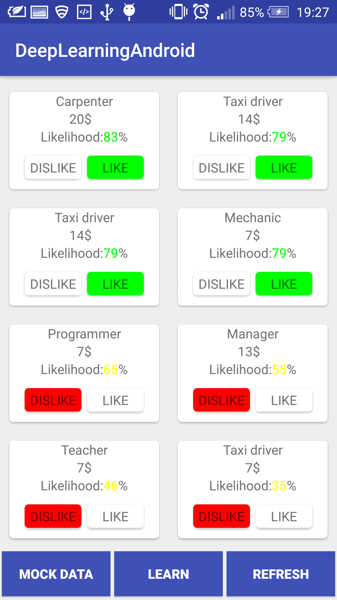

DeepLearningAndroid
===================================

This is an example of binary classification using the Deeplearning4j library. It's made to work with the Android platform but if you take just the important bits and use them in your Java project they should work too.
<br />

##1. What does this sample do?
This sample is an app with job listings. The jobs have different categories and hourly salaries. User chooses whether they like a listing or not. The app learns from user's choices and next time gives him another batch or random listings but ordered, starting from the ones most likely to be chosen by him.

Let's see what the flow looks like! Here's what we have at launch:

<br />
Then we make the selections. Best idea for testing is to try to mimic an actual job-seeker behavior, for example picking a mechanic job only if it pays more than 15$ an hour:

<br />
Then we click the learn button. We have to wait a few seconds while the learning is being proccessed in the background:

<br />
After that, we can refresh the list and see a new set of jobs, ordered by the probability of being chosen!

<br />
If you wish to see how well it performed, like or dislike all the new jobs and see if they are clearly divided into two parts (green and red). If the data in the previous set was poorly randomized (for example - every offer had the same salary) then it might take a few more cycles to teach the model properly, but you probably got something close to this:

<br />
There is also a Mock Data button that learns a sample set of 48 entries guided by this motivation:
-Like a mechanic    position only if it pays 6$ or more
-Like a programmer  position only if it pays 8$ or more
-Like a teacher     position only if it pays 10$ or more
-Like a taxi driver position only if it pays 12$ or more
-Like a manager     position only if it pays 14$ or more
-Like a carpenter   position only if it pays 16$ or more

##2. How does it work?
What you should pay attention to are the BinaryClassifier and LearnableModel classess. The first one provides the deep learning logic. The second is an interface you can implement in you own experimental app. BinaryClassifier expects a list of LearnableModels, so if you model implements it and you set the correct number of features and labels you should be able to use this code with any binary classification project. Here's how:

1. Initialize the BinaryClassifier with your number of features and labels
```java
    BinaryClassifier binaryClassifier = new BinaryClassifier(inputs, outputs);
```

2. Train your model given a list of classess implementing the LearnableModel interface
```java
    binaryClassifier.train(trainSet);
```

3. Predict the output given a list of classess implementing the LearnableModel interface
```java
    binaryClassifier.predict(predictionSet);
```

And that's it! In my code I used RxJava for multithreading purposes so it looks a little different, but you should be able to find all of these method calls in my MainActivity.